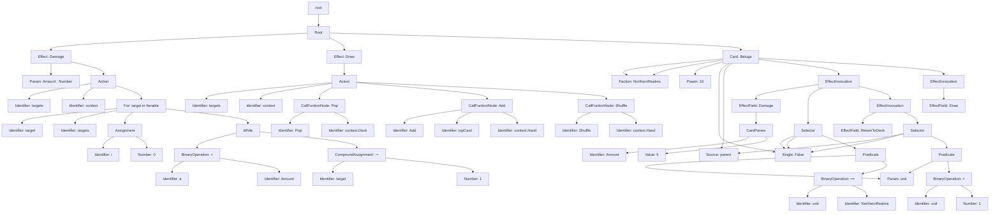

```mermaid
graph TD
55915408["Root"]
root --> 55915408
33476626["Effect: Damage"]
55915408 --> 33476626
32854180["Param: Amount : Number"]
33476626 --> 32854180
27252167["Action"]
33476626 --> 27252167
43942917["Identifier: targets"]
27252167 --> 43942917
59941933["Identifier: context"]
27252167 --> 59941933
2606490["For: target in Iterable"]
27252167 --> 2606490
23458411["Identifier: target"]
2606490 --> 23458411
9799115["Identifier: targets"]
2606490 --> 9799115
21083178["Assignment"]
2606490 --> 21083178
55530882["Identifier: i"]
21083178 --> 55530882
30015890["Number: 0"]
21083178 --> 30015890
1707556["While"]
2606490 --> 1707556
15368010["BinaryOperation: <"]
1707556 --> 15368010
4094363["Identifier: a"]
15368010 --> 4094363
36849274["Identifier: Amount"]
15368010 --> 36849274
63208015["CompoundAssignment: -="]
1707556 --> 63208015
32001227["Identifier: target"]
63208015 --> 32001227
19575591["Number: 1"]
63208015 --> 19575591
41962596["Effect: Draw"]
55915408 --> 41962596
42119052["Action"]
41962596 --> 42119052
43527150["Identifier: targets"]
42119052 --> 43527150
56200037["Identifier: context"]
42119052 --> 56200037
36038289["CallFuntionNode: Pop"]
42119052 --> 36038289
55909147["Identifier: Pop"]
36038289 --> 55909147
33420276["Identifier: context.Deck"]
36038289 --> 33420276
32347029["CallFuntionNode: Add"]
42119052 --> 32347029
22687807["Identifier: Add"]
32347029 --> 22687807
2863675["Identifier: topCard"]
32347029 --> 2863675
25773083["Identifier: context.Hand"]
32347029 --> 25773083
30631159["CallFuntionNode: Shuffle"]
42119052 --> 30631159
7244975["Identifier: Shuffle"]
30631159 --> 7244975
65204782["Identifier: context.Hand"]
30631159 --> 65204782
49972132["Card: Beluga"]
55915408 --> 49972132
3["Type: Oro"]
49972132 --> 3
3["Faction: NorthernRealms"]
49972132 --> 3
10["Power: 10"]
49972132 --> 10
0["Position: M"]
49972132 --> 0
1["Position: R"]
49972132 --> 1
47096010["EffectInvocation"]
49972132 --> 47096010
21210914["EffectField: Damage"]
47096010 --> 21210914
56680499["CardParam"]
21210914 --> 56680499
40362448["Identifier: Amount"]
56680499 --> 40362448
-1609706960["Value: 5"]
56680499 --> -1609706960
27717712["Selector"]
47096010 --> 27717712
0["Source: board"]
27717712 --> 0
0["Single: False"]
27717712 --> 0
48132822["Predicate"]
27717712 --> 48132822
1335070579["Param: unit"]
48132822 --> 1335070579
30542218["BinaryOperation: =="]
48132822 --> 30542218
6444509["Identifier: unit"]
30542218 --> 6444509
58000584["Identifier: NorthernRealms"]
30542218 --> 58000584
52243212["EffectInvocation"]
47096010 --> 52243212
426867["EffectField: ReturnToDeck"]
52243212 --> 426867
3841804["Selector"]
52243212 --> 3841804
1["Source: parent"]
3841804 --> 1
0["Single: False"]
3841804 --> 0
34576242["Predicate"]
3841804 --> 34576242
1335070579["Param: unit"]
34576242 --> 1335070579
42750725["BinaryOperation: <"]
34576242 --> 42750725
49212206["Identifier: unit"]
42750725 --> 49212206
40256670["Number: 1"]
42750725 --> 40256670
26765710["EffectInvocation"]
49972132 --> 26765710
39564799["EffectField: Draw"]
26765710 --> 39564799
```
