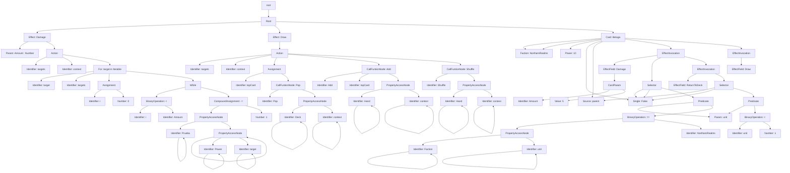

```mermaid
graph TD
55915408["Root"]
root --> 55915408
33476626["Effect: Damage"]
55915408 --> 33476626
32854180["Param: Amount : Number"]
33476626 --> 32854180
27252167["Action"]
33476626 --> 27252167
43942917["Identifier: targets"]
27252167 --> 43942917
59941933["Identifier: context"]
27252167 --> 59941933
2606490["For: target in Iterable"]
27252167 --> 2606490
23458411["Identifier: target"]
2606490 --> 23458411
9799115["Identifier: targets"]
2606490 --> 9799115
21083178["Assignment"]
2606490 --> 21083178
55530882["Identifier: i"]
21083178 --> 55530882
30015890["Number: 0"]
21083178 --> 30015890
1707556["While"]
2606490 --> 1707556
15368010["BinaryOperation: <"]
1707556 --> 15368010
4094363["Identifier: i"]
15368010 --> 4094363
36849274["Identifier: Amount"]
15368010 --> 36849274
63208015["CompoundAssignment: -="]
1707556 --> 63208015
32001227["PropertyAccessNode"]
63208015 --> 32001227
19575591["Property: Prueba"]
32001227 --> 19575591
19575591["Identifier: Prueba"]
19575591 --> 19575591
41962596["Target"]
32001227 --> 41962596
41962596["PropertyAccessNode"]
41962596 --> 41962596
42119052["Property: Power"]
41962596 --> 42119052
42119052["Identifier: Power"]
42119052 --> 42119052
43527150["Target"]
41962596 --> 43527150
43527150["Identifier: target"]
43527150 --> 43527150
56200037["Number: 1"]
63208015 --> 56200037
36038289["Effect: Draw"]
55915408 --> 36038289
55909147["Action"]
36038289 --> 55909147
33420276["Identifier: targets"]
55909147 --> 33420276
32347029["Identifier: context"]
55909147 --> 32347029
22687807["Assignment"]
55909147 --> 22687807
2863675["Identifier: topCard"]
22687807 --> 2863675
25773083["CallFuntionNode: Pop"]
22687807 --> 25773083
30631159["Identifier: Pop"]
25773083 --> 30631159
7244975["PropertyAccessNode"]
25773083 --> 7244975
65204782["Property: Deck"]
7244975 --> 65204782
65204782["Identifier: Deck"]
65204782 --> 65204782
49972132["Target"]
7244975 --> 49972132
49972132["Identifier: context"]
49972132 --> 49972132
47096010["CallFuntionNode: Add"]
55909147 --> 47096010
21210914["Identifier: Add"]
47096010 --> 21210914
56680499["Identifier: topCard"]
47096010 --> 56680499
40362448["PropertyAccessNode"]
47096010 --> 40362448
27717712["Property: Hand"]
40362448 --> 27717712
27717712["Identifier: Hand"]
27717712 --> 27717712
48132822["Target"]
40362448 --> 48132822
48132822["Identifier: context"]
48132822 --> 48132822
30542218["CallFuntionNode: Shuffle"]
55909147 --> 30542218
6444509["Identifier: Shuffle"]
30542218 --> 6444509
58000584["PropertyAccessNode"]
30542218 --> 58000584
52243212["Property: Hand"]
58000584 --> 52243212
52243212["Identifier: Hand"]
52243212 --> 52243212
426867["Target"]
58000584 --> 426867
426867["Identifier: context"]
426867 --> 426867
3841804["Card: Beluga"]
55915408 --> 3841804
3["Type: Oro"]
3841804 --> 3
3["Faction: NorthernRealms"]
3841804 --> 3
10["Power: 10"]
3841804 --> 10
0["Position: M"]
3841804 --> 0
1["Position: R"]
3841804 --> 1
34576242["EffectInvocation"]
3841804 --> 34576242
42750725["EffectField: Damage"]
34576242 --> 42750725
49212206["CardParam"]
42750725 --> 49212206
40256670["Identifier: Amount"]
49212206 --> 40256670
1207117720["Value: 5"]
49212206 --> 1207117720
26765710["Selector"]
34576242 --> 26765710
0["Source: board"]
26765710 --> 0
0["Single: False"]
26765710 --> 0
39564799["Predicate"]
26765710 --> 39564799
-1167977399["Param: unit"]
39564799 --> -1167977399
20538874["BinaryOperation: =="]
39564799 --> 20538874
50632145["PropertyAccessNode"]
20538874 --> 50632145
53036123["Property: Faction"]
50632145 --> 53036123
53036123["Identifier: Faction"]
53036123 --> 53036123
7563067["Target"]
50632145 --> 7563067
7563067["Identifier: unit"]
7563067 --> 7563067
958745["Identifier: NorthernRealms"]
20538874 --> 958745
8628710["EffectInvocation"]
34576242 --> 8628710
10549531["EffectField: ReturnToDeck"]
8628710 --> 10549531
27836922["Selector"]
8628710 --> 27836922
1["Source: parent"]
27836922 --> 1
0["Single: False"]
27836922 --> 0
49205706["Predicate"]
27836922 --> 49205706
-1167977399["Param: unit"]
49205706 --> -1167977399
40198173["BinaryOperation: <"]
49205706 --> 40198173
26239245["Identifier: unit"]
40198173 --> 26239245
34826618["Number: 1"]
40198173 --> 34826618
45004109["EffectInvocation"]
3841804 --> 45004109
2383799["EffectField: Draw"]
45004109 --> 2383799
```
