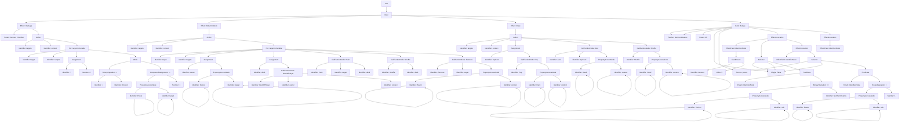

```mermaid
graph TD
43495525["Root"]
root --> 43495525
33476626["Effect: Damage"]
43495525 --> 33476626
32854180["Param: Amount : Number"]
33476626 --> 32854180
27252167["Action"]
33476626 --> 27252167
43942917["Identifier: targets"]
27252167 --> 43942917
59941933["Identifier: context"]
27252167 --> 59941933
2606490["For: target in Iterable"]
27252167 --> 2606490
23458411["Identifier: target"]
2606490 --> 23458411
9799115["Identifier: targets"]
2606490 --> 9799115
21083178["Assignment"]
2606490 --> 21083178
55530882["Identifier: i"]
21083178 --> 55530882
30015890["Number: 0"]
21083178 --> 30015890
1707556["While"]
2606490 --> 1707556
15368010["BinaryOperation: <"]
1707556 --> 15368010
4094363["Identifier: i"]
15368010 --> 4094363
36849274["Identifier: Amount"]
15368010 --> 36849274
63208015["CompoundAssignment: -="]
1707556 --> 63208015
32001227["PropertyAccessNode"]
63208015 --> 32001227
19575591["Property: Power"]
32001227 --> 19575591
19575591["Identifier: Power"]
19575591 --> 19575591
41962596["Target"]
32001227 --> 41962596
41962596["Identifier: target"]
41962596 --> 41962596
42119052["Number: 1"]
63208015 --> 42119052
43527150["Effect: ReturnToDeck"]
43495525 --> 43527150
56200037["Action"]
43527150 --> 56200037
36038289["Identifier: targets"]
56200037 --> 36038289
55909147["Identifier: context"]
56200037 --> 55909147
33420276["For: target in Iterable"]
56200037 --> 33420276
32347029["Identifier: target"]
33420276 --> 32347029
22687807["Identifier: targets"]
33420276 --> 22687807
2863675["Assignment"]
33420276 --> 2863675
25773083["Identifier: owner"]
2863675 --> 25773083
30631159["PropertyAccessNode"]
2863675 --> 30631159
7244975["Property: Owner"]
30631159 --> 7244975
7244975["Identifier: Owner"]
7244975 --> 7244975
65204782["Target"]
30631159 --> 65204782
65204782["Identifier: target"]
65204782 --> 65204782
49972132["Assignment"]
33420276 --> 49972132
47096010["Identifier: deck"]
49972132 --> 47096010
21210914["CallFuntionNode: DeckOfPlayer"]
49972132 --> 21210914
56680499["Identifier: DeckOfPlayer"]
21210914 --> 56680499
40362448["Identifier: owner"]
21210914 --> 40362448
27717712["Identifier: context"]
21210914 --> 27717712
48132822["CallFuntionNode: Push"]
33420276 --> 48132822
30542218["Identifier: Push"]
48132822 --> 30542218
6444509["Identifier: target"]
48132822 --> 6444509
58000584["Identifier: deck"]
48132822 --> 58000584
52243212["CallFuntionNode: Shuffle"]
33420276 --> 52243212
426867["Identifier: Shuffle"]
52243212 --> 426867
3841804["Identifier: deck"]
52243212 --> 3841804
34576242["CallFuntionNode: Remove"]
33420276 --> 34576242
42750725["Identifier: Remove"]
34576242 --> 42750725
49212206["Identifier: target"]
34576242 --> 49212206
40256670["PropertyAccessNode"]
34576242 --> 40256670
26765710["Property: Board"]
40256670 --> 26765710
26765710["Identifier: Board"]
26765710 --> 26765710
39564799["Target"]
40256670 --> 39564799
39564799["Identifier: context"]
39564799 --> 39564799
20538874["Effect: Draw"]
43495525 --> 20538874
50632145["Action"]
20538874 --> 50632145
53036123["Identifier: targets"]
50632145 --> 53036123
7563067["Identifier: context"]
50632145 --> 7563067
958745["Assignment"]
50632145 --> 958745
8628710["Identifier: topCard"]
958745 --> 8628710
10549531["CallFuntionNode: Pop"]
958745 --> 10549531
27836922["Identifier: Pop"]
10549531 --> 27836922
49205706["PropertyAccessNode"]
10549531 --> 49205706
40198173["Property: Deck"]
49205706 --> 40198173
40198173["Identifier: Deck"]
40198173 --> 40198173
26239245["Target"]
49205706 --> 26239245
26239245["Identifier: context"]
26239245 --> 26239245
34826618["CallFuntionNode: Add"]
50632145 --> 34826618
45004109["Identifier: Add"]
34826618 --> 45004109
2383799["Identifier: topCard"]
34826618 --> 2383799
21454193["PropertyAccessNode"]
34826618 --> 21454193
58870012["Property: Hand"]
21454193 --> 58870012
58870012["Identifier: Hand"]
58870012 --> 58870012
60068066["Target"]
21454193 --> 60068066
60068066["Identifier: context"]
60068066 --> 60068066
3741682["CallFuntionNode: Shuffle"]
50632145 --> 3741682
33675143["Identifier: Shuffle"]
3741682 --> 33675143
34640832["PropertyAccessNode"]
3741682 --> 34640832
43332040["Property: Hand"]
34640832 --> 43332040
43332040["Identifier: Hand"]
43332040 --> 43332040
54444047["Target"]
34640832 --> 54444047
54444047["Identifier: context"]
54444047 --> 54444047
20234383["Card: Beluga"]
43495525 --> 20234383
3["Type: Oro"]
20234383 --> 3
3["Faction: NorthernRealms"]
20234383 --> 3
90["Power: 90"]
20234383 --> 90
0["Position: M"]
20234383 --> 0
1["Position: R"]
20234383 --> 1
47891719["EffectInvocation"]
20234383 --> 47891719
28372289["EffectField: IdentifierNode"]
47891719 --> 28372289
54024015["CardParam"]
28372289 --> 54024015
16454088["Identifier: Amount"]
54024015 --> 16454088
5["Value: 5"]
54024015 --> 5
13869071["Selector"]
47891719 --> 13869071
0["Source: board"]
13869071 --> 0
0["Single: False"]
13869071 --> 0
57712780["Predicate"]
13869071 --> 57712780
49652976["Param: IdentifierNode"]
57712780 --> 49652976
44223604["BinaryOperation: =="]
57712780 --> 44223604
62468121["PropertyAccessNode"]
44223604 --> 62468121
25342185["Property: Faction"]
62468121 --> 25342185
25342185["Identifier: Faction"]
25342185 --> 25342185
26753075["Target"]
62468121 --> 26753075
26753075["Identifier: unit"]
26753075 --> 26753075
39451090["Identifier: NorthernRealms"]
44223604 --> 39451090
19515494["EffectInvocation"]
47891719 --> 19515494
41421720["EffectField: IdentifierNode"]
19515494 --> 41421720
37251161["Selector"]
19515494 --> 37251161
1["Source: parent"]
37251161 --> 1
0["Single: False"]
37251161 --> 0
66824994["Predicate"]
37251161 --> 66824994
64554036["Param: IdentifierNode"]
66824994 --> 64554036
44115416["BinaryOperation: <"]
66824994 --> 44115416
61494432["PropertyAccessNode"]
44115416 --> 61494432
16578980["Property: Power"]
61494432 --> 16578980
16578980["Identifier: Power"]
16578980 --> 16578980
14993092["Target"]
61494432 --> 14993092
14993092["Identifier: unit"]
14993092 --> 14993092
720107["Number: 1"]
44115416 --> 720107
6480969["EffectInvocation"]
20234383 --> 6480969
58328727["EffectField: IdentifierNode"]
6480969 --> 58328727
```
