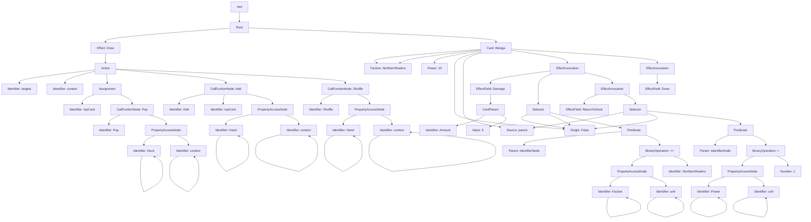

```mermaid
graph TD
43495525["Root"]
root --> 43495525
33476626["Effect: Draw"]
43495525 --> 33476626
32854180["Action"]
33476626 --> 32854180
27252167["Identifier: targets"]
32854180 --> 27252167
43942917["Identifier: context"]
32854180 --> 43942917
59941933["Assignment"]
32854180 --> 59941933
2606490["Identifier: topCard"]
59941933 --> 2606490
23458411["CallFuntionNode: Pop"]
59941933 --> 23458411
9799115["Identifier: Pop"]
23458411 --> 9799115
21083178["PropertyAccessNode"]
23458411 --> 21083178
55530882["Property: Deck"]
21083178 --> 55530882
55530882["Identifier: Deck"]
55530882 --> 55530882
30015890["Target"]
21083178 --> 30015890
30015890["Identifier: context"]
30015890 --> 30015890
1707556["CallFuntionNode: Add"]
32854180 --> 1707556
15368010["Identifier: Add"]
1707556 --> 15368010
4094363["Identifier: topCard"]
1707556 --> 4094363
36849274["PropertyAccessNode"]
1707556 --> 36849274
63208015["Property: Hand"]
36849274 --> 63208015
63208015["Identifier: Hand"]
63208015 --> 63208015
32001227["Target"]
36849274 --> 32001227
32001227["Identifier: context"]
32001227 --> 32001227
19575591["CallFuntionNode: Shuffle"]
32854180 --> 19575591
41962596["Identifier: Shuffle"]
19575591 --> 41962596
42119052["PropertyAccessNode"]
19575591 --> 42119052
43527150["Property: Hand"]
42119052 --> 43527150
43527150["Identifier: Hand"]
43527150 --> 43527150
56200037["Target"]
42119052 --> 56200037
56200037["Identifier: context"]
56200037 --> 56200037
36038289["Card: Beluga"]
43495525 --> 36038289
3["Type: Oro"]
36038289 --> 3
3["Faction: NorthernRealms"]
36038289 --> 3
10["Power: 10"]
36038289 --> 10
0["Position: M"]
36038289 --> 0
1["Position: R"]
36038289 --> 1
55909147["EffectInvocation"]
36038289 --> 55909147
33420276["EffectField: Damage"]
55909147 --> 33420276
32347029["CardParam"]
33420276 --> 32347029
22687807["Identifier: Amount"]
32347029 --> 22687807
-759250538["Value: 5"]
32347029 --> -759250538
2863675["Selector"]
55909147 --> 2863675
0["Source: board"]
2863675 --> 0
0["Single: False"]
2863675 --> 0
25773083["Predicate"]
2863675 --> 25773083
30631159["Param: IdentifierNode"]
25773083 --> 30631159
7244975["BinaryOperation: =="]
25773083 --> 7244975
65204782["PropertyAccessNode"]
7244975 --> 65204782
49972132["Property: Faction"]
65204782 --> 49972132
49972132["Identifier: Faction"]
49972132 --> 49972132
47096010["Target"]
65204782 --> 47096010
47096010["Identifier: unit"]
47096010 --> 47096010
21210914["Identifier: NorthernRealms"]
7244975 --> 21210914
56680499["EffectInvocation"]
55909147 --> 56680499
40362448["EffectField: ReturnToDeck"]
56680499 --> 40362448
27717712["Selector"]
56680499 --> 27717712
1["Source: parent"]
27717712 --> 1
0["Single: False"]
27717712 --> 0
48132822["Predicate"]
27717712 --> 48132822
30542218["Param: IdentifierNode"]
48132822 --> 30542218
6444509["BinaryOperation: <"]
48132822 --> 6444509
58000584["PropertyAccessNode"]
6444509 --> 58000584
52243212["Property: Power"]
58000584 --> 52243212
52243212["Identifier: Power"]
52243212 --> 52243212
426867["Target"]
58000584 --> 426867
426867["Identifier: unit"]
426867 --> 426867
3841804["Number: 1"]
6444509 --> 3841804
34576242["EffectInvocation"]
36038289 --> 34576242
42750725["EffectField: Draw"]
34576242 --> 42750725
```
